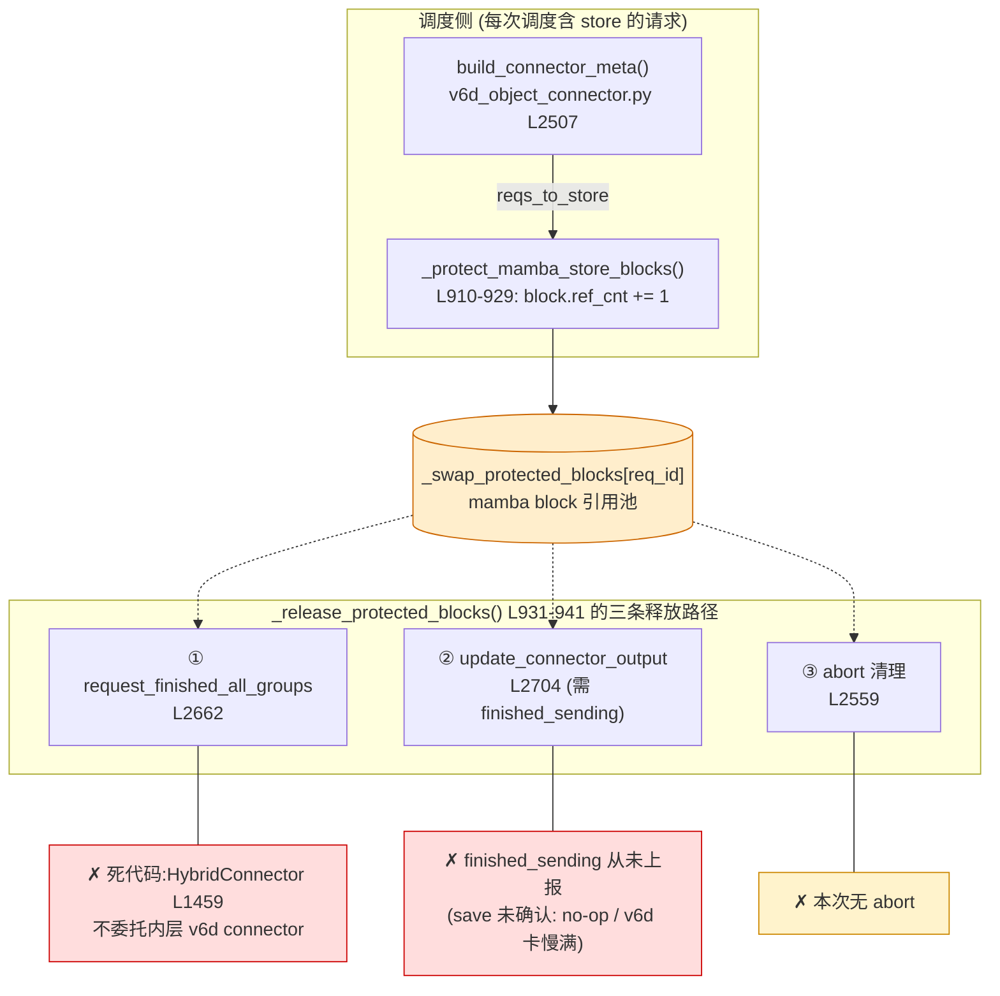
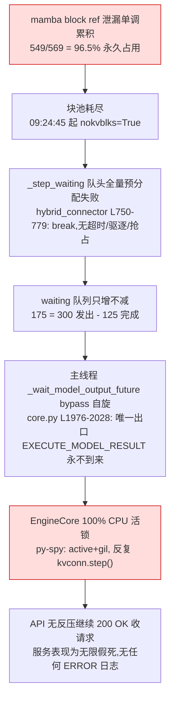
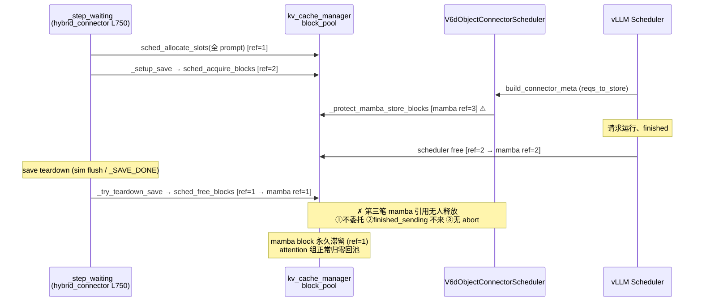

# vLLM + v6d 服务卡死根因分析报告:mamba block ref_cnt 保护泄漏

> 日期:2026-08-07
> 场景:`tmp.out/l20b/capacity` 容量驱逐仿真测试(`bench_shuffle.sh` + `server.sim.sh`)
> 现象:Phase 1 进行到约 125 个请求后服务假死,请求全部堆积,无任何错误日志
> 结论:**非崩溃、非阻塞,而是活锁(livelock)**;根因为 v6d connector 的
> mamba block `ref_cnt` 保护只加不减,耗尽 GPU KV block 池
> 适用范围:**真实部署(非仿真)同样存在此缺陷**,仿真只是将触发条件常态化

---

## 1. 结论速览

| 项目 | 内容 |
|---|---|
| 直接根因 | `_protect_mamba_store_blocks` 对 mamba block `ref_cnt += 1`,三条释放路径在 hybrid 模式下全部断裂 |
| 泄漏量 | 549 个 block 引用(mamba group 0/1/2 各 183 个),块池共 569 → **549/569 = 96.5% ≈ 冻结的 96.7%** |
| 卡死形态 | EngineCore 主线程在 `_wait_model_output_future` bypass 循环中 100% CPU 自旋 |
| 结构性缺陷 | `HybridConnector.request_finished_all_groups` 不委托内层 v6d connector → 请求 finish 时无兜底释放 |
| 真实环境触发条件 | v6d save 慢/满/卡(`finished_sending` 断流)即触发同样泄漏与卡死 |

---

## 2. 故障时间线(日志实证)

日志:`tmp.out/l20b/capacity/log/server_1.log`、`log/v6d_1.log`

```
09:17:25  v6d daemon 启动(虚拟容量 500G,tracker 实际为 memory 类型,Redis 未接入)
09:23:25  Phase 1 开始;每个请求 exists RPC 均 500 后回退 plain exists(次要问题,见 §7)
09:23:25~09:24:44  正常运行:125 个请求 分配=运行=完成 三方对账平衡
09:24:45  首次出现 add req ... nokvblks=True(块池首次分配失败)
09:24:49  v6d 侧最后一次 BATCH_CREATE(creates 冻结在 1174,total_gets=0)
09:24:50  最后一个请求 finished;此后 metrics 永久冻结:
          Running: 0, Waiting: 0, GPU KV cache usage: 96.7%
09:26:09+ HybridScheduler status: waiting=175(=300-125)只增不减,
          loaded=0 saved=0 saving=0 loading=0 —— 所有队列为空,唯独 waiting 堆死
此后     v6d/redis 进程存活、/health 正常,EngineCore CPU ~81-89% 空转
```

---

## 3. 根因机制

### 3.1 加保护:每次下发 store 元数据时 ref_cnt++

`vllm/distributed/kv_transfer/kv_connector/v1/v6d_object_connector.py`

| 位置 | 内容 |
|---|---|
| L910-929 | `_protect_mamba_store_blocks()`:对 `reqs_to_store` 中 mamba 组的每个 GPU block 执行 `block.ref_cnt += 1`,记入 `self._swap_protected_blocks[req_id]` |
| L2507 | 调用点:`build_connector_meta()` 内,**每次调度含 store 的请求都会触发** |
| L829-840 | 开关确认:本次运行日志打印 `protect_mamba_blocks_in_block_pool=True, is_hybrid_backend=True` |

```python
# v6d_object_connector.py L925-929
for block_id in gpu_block_ids:
    block = self._block_pool.blocks[block_id]
    block.ref_cnt += 1                                   # ← 加保护
    self._swap_protected_blocks[req_id].append(block)
```

### 3.2 解保护:`_release_protected_blocks`(L931-941)仅有三个调用点,全部不可达

| # | 调用点 | 断裂原因 |
|---|---|---|
| ① | L2662,`request_finished_all_groups()` 正常完成清理 | **死代码**:vLLM scheduler 实际调用的是顶层 `HybridConnector.request_finished_all_groups`(`vllm/v1/hybrid_connector/__init__.py` L1459),该实现只处理 PD/KVT 参数(`P_REMOTE_DECODE`/`_PD_SAVED`),**从不委托给内层 v6d connector** |
| ② | L2704,`update_connector_output()` 收到 worker 上报的 `finished_sending` | save 从未确认完成:整个 server_1.log 中 `finished_sending` **0 条**。仿真中 save 为 no-op 不上报;真实环境中 v6d 慢/满/卡时同样断流 |
| ③ | L2559,abort 清理路径 | 本次运行无任何 abort(`aborting=0`) |

### 3.3 泄漏 → 块池耗尽 → 队头阻塞 → 活锁

`vllm/v1/hybrid_connector/__init__.py`

| 位置 | 内容 |
|---|---|
| L750-779 | `_step_waiting()`:bypass 请求进调度器前须一次性分配**整个 prompt** 的 block(`sched_allocate_slots`);队头分配失败即 `break`,**无超时、无驱逐触发、无抢占** |
| L723-733 | `_setup_save()`:`sched_acquire_blocks(kvblks)` 另一套 ref 保护(本次已被 sim hook 正确释放,`saving=0` 佐证,非本次泄漏源;但真实环境同样依赖 `_SAVE_DONE_REQ` RPC,是同类风险点) |
| L686-720 | `_step_saved()`:`_saved` 队列唯一生产者是 worker 的 `_SAVE_DONE_REQ` RPC(L640 注册,`_on_save_done` L954) |

`vllm/v1/engine/core.py`

| 位置 | 内容 |
|---|---|
| L1930-2028 | `EngineCoreProc._wait_model_output_future()`:bypass 自旋循环,`kvconn.has_requests()` 为真时反复 `kvconn.step()`;唯一出口是 `EXECUTE_MODEL_RESULT`,无 watchdog |
| L674 | `step()` 调用点 |

`vllm/v1/hybrid_connector/engine_proxy.py`

| 位置 | 内容 |
|---|---|
| L81-111 | `sched_allocate_slots()`:`num_new_tokens = 全 prompt`,失败返回 None |
| L133-146 | `sched_free_blocks()` / `sched_acquire_blocks()`(直接操作 `block.ref_cnt`) |

### 3.4 泄漏机制图



### 3.5 活锁传导链



### 3.6 请求生命周期中 block 引用收支(为什么恰好泄漏 mamba 组)



---

## 4. 关键证据

### 4.1 py-spy 活体栈(pid 4189552,CPU 81-89%)

```
Thread (active+gil): "MainThread"
    _step_waiting (vllm/v1/hybrid_connector/__init__.py:754)
      Locals: req=<Request>, load_count=1, save_count=1
    step (vllm/v1/hybrid_connector/__init__.py:682)
    override_step (v6d_manager.py:709)   Locals: saving={}  ← _saving 已空,排除该泄漏源
    step (vllm/v1/hybrid_connector/__init__.py:1402)
    _wait_model_output_future (vllm/v1/engine/core.py:2007)  ← bypass 自旋
    step (vllm/v1/engine/core.py:674)    Locals: future=<Future ...> 永不完成
    run_busy_loop (vllm/v1/engine/core.py:1585)
```

### 4.2 数字对账(决定性)

| 指标 | 值 | 来源 |
|---|---|---|
| 请求对账 | 分配 125 = 运行 125 = 完成 125 | server_1.log(排除请求级泄漏) |
| protect 事件(ref_cnt++ 次数) | **549** | 解析全部 `reqs_to_store` 元数据中 mamba 组 block id |
| 被保护的不同 block | group 0/1/2 **各 183 个** | 同上 |
| 块池总量 | 569(`--num-gpu-blocks-override 569`) | server.sim.sh |
| 推算占用 | 549/569 = **96.5%** | — |
| 实测冻结占用 | **96.7%**(Running=0 时) | loggers.py:433 metrics |
| `finished_sending` 日志条数 | **0** | 全量 grep |
| `saving` / `loading` / `saved` 队列 | 全部 0(冻结时) | HybridScheduler status 行 |

### 4.3 v6d / Redis 侧状态(卡死时实测)

| 项目 | 状态 |
|---|---|
| v6d daemon(:7890) | 存活,`/health` ok;`creates=1174 total_gets=0 total_hits=0` 永久冻结;从未触发驱逐 |
| Redis(:6379) | 存活但 `dbsize=0` **完全为空** |
| Tracker | `Tracker connected: type=memory, tracker_url=None` —— `--tracker-redis` 参数未生效,实际用内存 tracker |

---

## 5. 与真实(非仿真)环境的关系

用户反馈同样的卡死在真实部署中出现过。两者根因一致,差异仅在触发条件:

| | 仿真(本次) | 真实部署 |
|---|---|---|
| 常规释放通道 | 路径②(finished_sending)因 save no-op 而**恒断** | 路径②正常工作时块能释放 |
| 触发条件 | 必现 | v6d 慢/写满/daemon 卡(如 tracker Redis 不可达导致阻塞)→ `finished_sending` 断流 → 泄漏开始 |
| 兜底 | 无:路径①(finish 时释放)因 HybridConnector L1459 不委托而**恒断** | 同样恒断 —— **一旦②断流,泄漏只增不减,必然卡死** |
| 卡死指纹 | `waiting=N` 冻结、`saving=0`、GPU KV 高位冻结、Running=0、CPU 自旋 | 同左;若 save 卡在途,`saving=N` 非零冻结、`mark saved.` 日志停止 |

真实环境排查清单:
1. `HybridScheduler status:` 行中 `waiting` 是否只增不减、`saving` 是否非零冻结;
2. `mark saved. reqid=` / `finished_sending` 日志是否在卡死时刻前停止;
3. GPU KV usage 是否在 `Running: 0` 时高位冻结;
4. EngineCore 进程 CPU 是否高位空转(py-spy 栈落在 `_wait_model_output_future`)。

---

## 6. 修复建议(按根治程度排序)

| # | 修复 | 位置 | 说明 |
|---|---|---|---|
| 1 | **finish 兜底委托**:`HybridConnector.request_finished_all_groups` 委托内层 v6d connector(至少调用其 `request_finished_all_groups` / `_release_protected_blocks`) | `hybrid_connector/__init__.py` L1459 | 最小根治:请求 finish 即释放保护,即使 finished_sending 丢失也不会永久泄漏 |
| 2 | **保护超时 sweep**:`_swap_protected_blocks` 记录时间戳,后台周期强制释放超 deadline 的保护并告警 | `v6d_object_connector.py` L882/910 | 防上报丢失类故障;数据一致性上仅损失一份 v6d 缓存副本 |
| 3 | **save-done 必达**:worker 侧 v6d put 异常/超时也必须上报(带错误标记的 finished_sending / `_SAVE_DONE_REQ`) | worker 侧 connector | 消除"异常吞掉回调"这一类触发源 |
| 4 | **_step_waiting 可观测 + 反饥饿**:队头分配失败时打印 block pool 诊断(free/protected 计数);失败超阈值降级或触发驱逐;`_waiting` 长度准入反压 | `hybrid_connector/__init__.py` L750 | 把"假死"变成可观测告警 |
| 5 | bypass 自旋循环 watchdog:空转超阈值 dump 状态 | `core.py` L1976 | 监控兜底 |

## 7. 次要问题(非本次死因,建议一并修)

1. **exists RPC 500 回退**:`_sim_client_exists`(`src/sglang_simulator/simulation/vllm/v6d/v6d_manager.py` L30-61)向 daemon 发送带 `request_id` 的 exists,但注释中提到的 daemon 侧配套 hook `C_V6dDaemonExistsHook` 在代码库中不存在 → 每请求先 500 再回退,增加噪音与调度路径延迟。
2. **容量配置与测试意图矛盾**:`bench_shuffle.sh` 假设 80G 容量(阈值 236 请求触发自驱逐),`server.sim.sh` L55 实际 `start_v6d 500G`(注释还写着 10G)→ 驱逐永不触发,shuffle 驱逐测试前提不成立。
3. **`--tracker-redis` 未生效**:peer 初始化 `tracker_url=None`,实际使用内存 tracker,Redis 空置。单机无碍,跨节点 P2P 会失效。

---

## 附录:涉及文件索引

| 文件 | 关键位置 |
|---|---|
| `vllm/distributed/kv_transfer/kv_connector/v1/v6d_object_connector.py` | L829-840(开关)、L863/865(pending 集合)、L882(保护记录)、L910-929(加保护)、L931-941(解保护)、L2507(调用点)、L2559/L2662/L2704(三条释放路径)、L2590-2668(request_finished*)、L2680-2748(update_connector_output) |
| `vllm/v1/hybrid_connector/__init__.py` | L640-643(save/load done RPC 注册)、L682(step)、L686-720(_step_saved)、L723-748(_setup_save/_try_teardown_save)、L750-793(_step_waiting)、L836-870(_step_aborting)、L1083-1104(status 日志)、L1402(HybridConnector.step)、L1459-1493(request_finished_all_groups 不委托) |
| `vllm/v1/hybrid_connector/engine_proxy.py` | L81-111(sched_allocate_slots)、L133-146(sched_free/acquire_blocks) |
| `vllm/v1/engine/core.py` | L615-622(基类 wait)、L674(step 调用)、L1585(run_busy_loop)、L1930-2028(bypass 自旋循环) |
| `tmp.out/l20b/capacity/log/server_1.log` | 全量时间线与元数据证据 |
| `tmp.out/l20b/capacity/log/v6d_1.log` | v6d 侧 creates/gets/驱逐/tracker 证据 |
| `src/sglang_simulator/simulation/vllm/v6d/v6d_manager.py` | L30-61(exists 回退)、L550-574(request_finished 劫持)、L675-714(_saving flush hook) |

---

## 附录 B:cherry-pick 冲突解决记录

> commit `5b7bcf7503d4412e6dcc2b7edec764bbae58804f`(`fix-vllm-p2p-bak` 分支)
> cherry-pick 到 `feat/vllm-v6d-dev-lsy` 分支时的冲突与解决

### 冲突根因

`feat/vllm-v6d-dev-lsy` 在 `5b7bcf7` 之后引入了带宽建模(commit `3ed12ce19`
*feat(sim): model v6d transfer/completion latency for cross-node hit fidelity*),
将 `C_HybridConnectorHook.override_bind_connector_metadata` 和
`override_get_finished` 从"即时完成 + `_sim_finished_store_reqs`"改写为
基于 `BandwidthModel` 的 deadline 机制(`_sim_pending_store` / `_sim_pending_load`)。
`5b7bcf7` 基于旧版简单实现,两者对同一函数体做了不兼容的修改,产生三方合并冲突。

### 解决策略

| 区域 | HEAD(dev-lsy) | commit(5b7bcf7) | 解决 |
|---|---|---|---|
| `_save_ctrl_latency` | 定义但未被调用(死代码) | 无 | **删除** |
| `_resolve_reqs_to_store` | 无(手动 getattr 链) | 新增(通用 nesting walker) | **采用 commit 版** |
| `_sim_block_count` | 有(BandwidthModel 依赖) | 无 | **保留 HEAD 版** |
| store 完成路径 | `_sim_pending_store` deadline(get_finished 上报) | `mark_backend_save_done`(真实 _SAVE_DONE_REQ RPC 通道) | **采用 commit 版**:save 完成走真实 RPC 通道,get_finished 不再上报 store reqs |
| load 完成路径 | `_sim_pending_load` deadline(BandwidthModel 延迟建模) | `_sim_finished_load_reqs`(即时完成) | **保留 HEAD 版**:load 延迟建模是独立的保真度增强,不与 save-done 哲学冲突 |
| `override_update_connector_output` | 保留(委托 scheduler) | 删除(死代码,hybrid 模式下 base no-op) | **采用 commit 版**:删除 |
| `C_HybridSchedulerHook` | 保留(`_saving` flush) | 删除(破坏 async_cleanup 链) | **采用 commit 版**:删除 |

### 设计原则

save 完成与 load 完成遵循不同的生产通道:

- **save** → `mark_backend_save_done`(等价 worker 的 `_SAVE_DONE_REQ` RPC)→
  `_do_save_done` → `_try_teardown_save` → `async_cleanup`(seal v6d 对象 +
  释放 mamba 保护块)。**不应**通过 `get_finished` / `finished_sending` 上报
  (hybrid 模式下该路径为 base no-op)。
- **load** → `get_finished` 返回 `finished_recving`(生产中确实走此通道)→
  由 `_sim_pending_load` deadline 建模真实 DMA 延迟。

两者互不冲突:删掉 `_sim_pending_store`(save 不再走 get_finished)不影响
`_sim_pending_load`(load 仍走 get_finished 的 deadline 机制)。

### rebase 冲突(第二轮)

`git pull --rebase` 时与同事提交 `3bc8c6df5`(*feat(sim): model store completion
as max(DMA, poll)+rank_sync*)冲突。该提交将 `_sim_pending_store` 的延迟公式从
`latency_for + save_completion_latency` 改为结构化的 `store_completion_latency`
(= `max(DMA, poll_granularity) + rank_sync`)。

由于 cherry-pick 已删除 `_sim_pending_store` 整块,该改动失去挂靠点。解决方式:
将同事的 `store_completion_latency` 模型集成到 `mark_backend_save_done` 的延迟中——
按请求 block 数计算 `max(DMA, poll) + rank_sync` 作为 save-done RPC 的到达延迟。
同事在 `bandwidth.py` / 校准工具 / 文档中的改动不受影响,正常合入。

